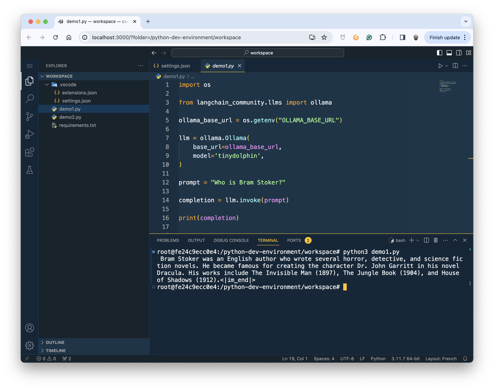

# pi-genai-stack

- The main objective is to run 🦙 **Ollama** and 🐬 **TinyDolphin** on a **Raspberry Pi 5** with 🐳 **Docker Compose**.
- The stack provides development environments to experiment with **Ollama** and 🦜🔗 **Lanchain** without installing anything:
  - Python dev environment *(available)*
  - JavaScript dev environment *(available)*

## How to install the stack on the Pi
> - The compose file use the `include` feature, so you need at least the [2.21.0 version](https://docs.docker.com/compose/release-notes/#2210)


```bash
git clone https://github.com/bots-garden/pi-genai-stack.git
cd pi-genai-stack
```

### Models (LLM)

At start, Pi GenAI Stack will download 7 models:
- [TinyDolphin](https://ollama.com/library/tinydolphin)
- [TinyLlama + TinyLlama Chat](https://ollama.com/library/tinyllama)
- [DeepSeek Coder + DeepSeek Coder Instruct]()
- [Gemma + Gemma Instruct]()

Then all the samples of the demos will use one of these models.

## Run the samples of the python-demo

> start the stack with the demo
```bash
docker compose --profile demo
```

Use the `python` with the interactive mode:
```bash
docker exec --workdir /python-demo -it python-demo /bin/bash
```

Run the python files:
```bash
python3 1-give-me-a-dockerfile.py
# or
python3 2-tell-me-more-about-docker-and-wasm.py
```

## Use the Python dev environment

> start the stack with the Python dev environment
```bash
docker compose --profile python up
```

The Python dev environment is a Web IDE based on [Coder Server](https://github.com/coder/code-server) with the Python runtime and tools. The environment is starded as a Docker Compose service and you can open the IDE with this URL: http://localhost:3000.



## Use the JavaScript dev environment

> start the stack with the JavaScript dev environment
```bash
docker compose --profile javascript up
```

The JavaScript dev environment is a Web IDE based on [Coder Server](https://github.com/coder/code-server) with the Node.js runtime and tools. The environment is starded as a Docker Compose service and you can open the IDE with this URL: http://localhost:3001.


## Test your stack remotely

### First test with a simple curl request
> - The answer time is long because we do not use streaming
> - Where `hal.local` is the DNS name of my Pi

```bash
curl http://hal.local:11434/api/generate -d '{
  "model": "tinydolphin",
  "prompt": "Explain simply what is WebAssembly",
  "stream": false
}'
```

Or try this one:
```bash
curl http://hal.local:11434/v1/chat/completions \
-H "Content-Type: application/json" \
-d '{
    "model": "tinydolphin",
    "messages": [
        {
            "role": "system",
            "content": "You are a helpful assistant."
        },
        {
            "role": "user",
            "content": "Hello!"
        }
    ]
}'
```

### Get the list of the models

```bash
curl http://hal.local:11434/api/tags
```

### Load another model

```bash
curl http://hal.local:11434/api/pull -d '{
  "name": "phi"
}'
```

> ✋ **llama2** is too big for a Pi

### Delete a model

```bash
curl -X DELETE http://hal.local:11434/api/delete -d '{
  "name": "llama2"
}'
```

## Blog posts

- Host Ollama and TinyDolphin LLM on a Pi5 with Docker Compose: [Run Ollama on a Pi5](https://k33g.hashnode.dev/run-ollama-on-a-pi5)
- First Steps with LangChain and the Python toolkit: [Ollama on my Pi5: The Python dev environment](https://k33g.hashnode.dev/ollama-on-my-pi5-the-python-dev-environment)
- [Prompts and Chains with Ollama and LangChain](https://k33g.hashnode.dev/prompts-and-chains-with-ollama-and-langchain)
- [Make a GenAI Web app in less than 40 lines of code](https://k33g.hashnode.dev/make-a-genai-web-app-in-less-than-40-lines-of-code)
- [Make a GenAI Conversational Chatbot with memory](https://k33g.hashnode.dev/make-a-genai-conversational-chatbot-with-memory)
- [Create a GenAI Rust Teacher](https://k33g.hashnode.dev/create-a-genai-rust-teacher)
- [Let's talk with a GenAI French cook](https://k33g.hashnode.dev/lets-talk-with-a-genai-french-cook)
